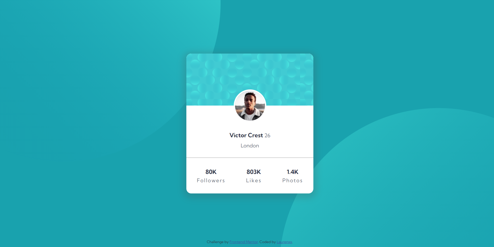

# Frontend Mentor - Profile card component solution

This is a solution to the [Profile card component challenge on Frontend Mentor](https://www.frontendmentor.io/challenges/profile-card-component-cfArpWshJ). Frontend Mentor challenges help you improve your coding skills by building realistic projects. 

## Table of contents

- [Overview](#overview)
  - [The challenge](#the-challenge)
  - [Screenshot](#screenshot)
  - [Links](#links)
- [My process](#my-process)
  - [Built with](#built-with)
- [Author](#author)

## Overview

### The challenge

- Build out the project to the designs provided

### Screenshot

### Links

- Solution URL: [https://www.frontendmentor.io/solutions/profile-card-component-using-flexbox-W1B-hytzdI](https://your-solution-url.com)
- Live Site URL: [https://awsmpuff.github.io/profile-card-component/](https://your-live-site-url.com)

## My process

### Built with

- Semantic HTML5 markup
- CSS custom properties
- Flexbox
- Mobile-first workflow

## Author

- Website - [Wanxia Xie/Laurenxx](https://www.your-site.com)
- Frontend Mentor - [@awsmPuff](https://www.frontendmentor.io/profile/awsmPuff)
